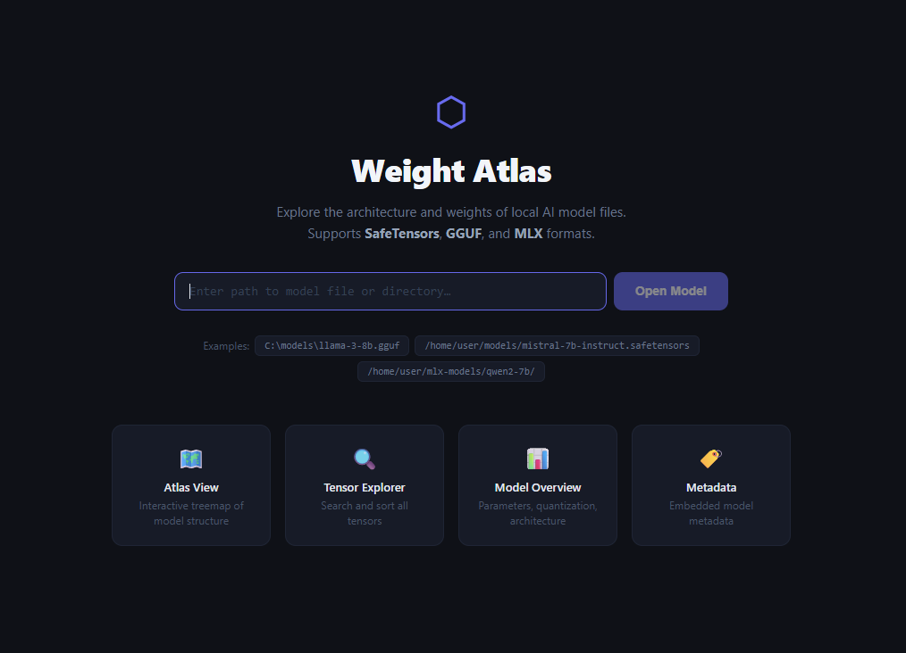
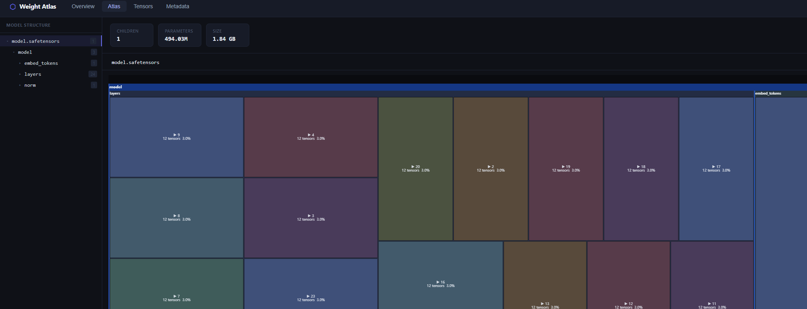
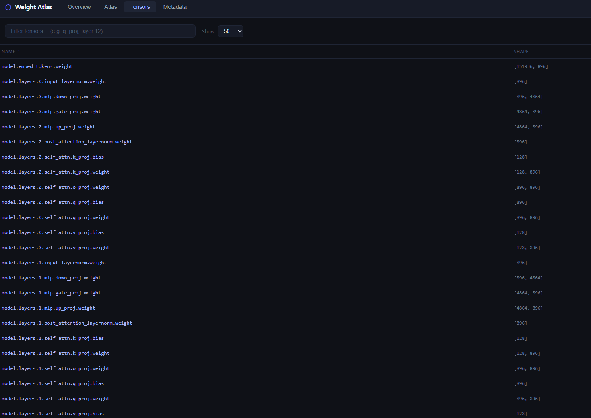
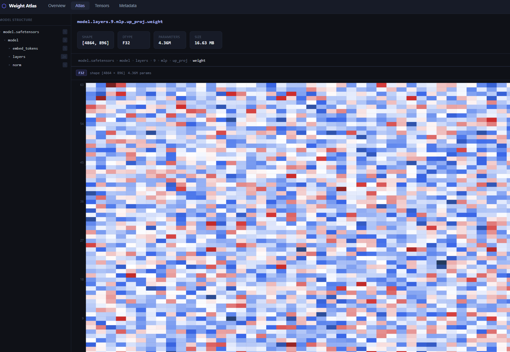
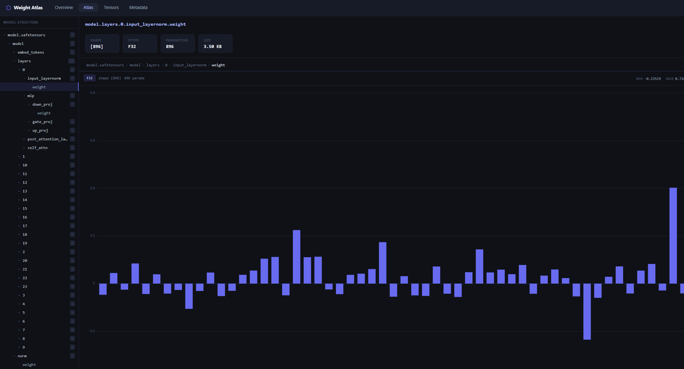
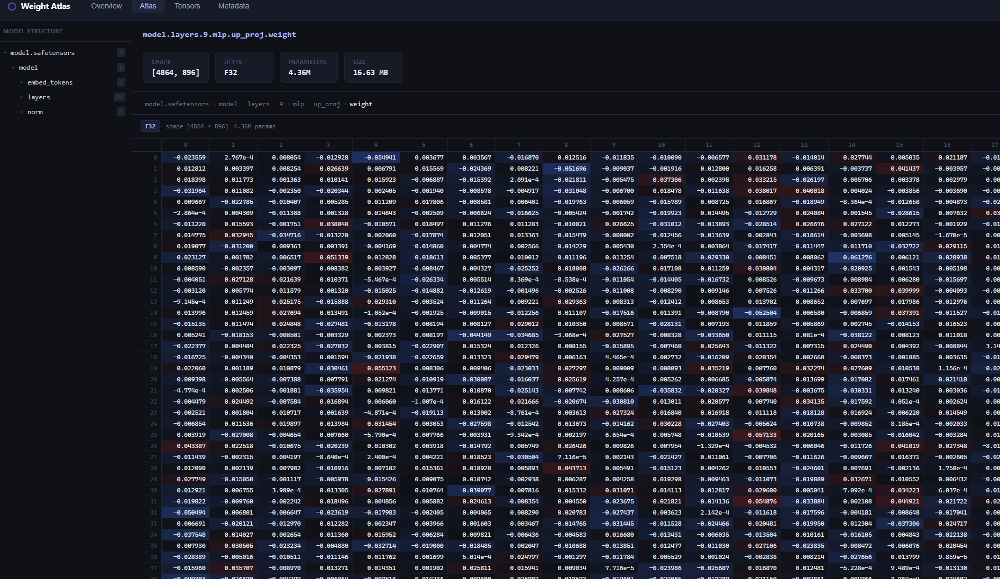

# Weight Atlas

> *Human said, AI made.* — Davut Engin

A local AI model explorer that runs entirely on your machine. Open any `.safetensors`, `.gguf` or MLX model file and instantly browse its weights, tensors, and metadata — no cloud, no telemetry, no account.

  



---

## What it does

- **Overview** — model name, format, parameter count, file size, quantization type, architecture
- **Atlas** — interactive treemap showing how parameters are distributed across layers. Click to drill in, navigate with the tree on the left
- **Tensors** — sortable/searchable table of every tensor. Click a row to view the actual values as a heatmap or bar chart, or browse them in an Excel-like grid
- **Metadata** — all embedded key-value metadata from the model file

Supported formats: `SafeTensors`, `GGUF` (including quantized: Q4_0, Q4_1, Q5_0, Q5_1, Q8_0, BF16…), `MLX`

---

## Screenshots

**Atlas — parameter distribution treemap**


**Tensors — full tensor list with search and filter**


**Weight viewer — heatmap (2D tensors)**


**Weight viewer — bar chart (1D tensors)**


**Weight viewer — table / Excel mode**


---

## Installation

### Requirements

- Python 3.11 or newer
- Node.js 18 or newer (only needed to build the frontend once)

---

### Windows

```bat
git clone https://github.com/davutengin/weight-atlas.git
cd weight-atlas
setup.bat
```

`setup.bat` installs Python dependencies and builds the frontend in one step.

Then to run:

```bat
python weightatlas.py
```

The app opens at `http://localhost:8000` in your browser.

---

### macOS / Linux

```bash
git clone https://github.com/davutengin/weight-atlas.git
cd weight-atlas

# Install Python dependencies
pip install -r backend/requirements.txt

# Build the frontend
cd frontend
npm install
npm run build
cd ..

# Run
python weightatlas.py
```

The app opens at `http://localhost:8000` in your browser.

---

### Using a virtual environment (recommended)

```bash
python -m venv .venv

# Windows
.venv\Scripts\activate

# macOS / Linux
source .venv/bin/activate

pip install -r backend/requirements.txt
```

---

## Usage

1. Run `python weightatlas.py`
2. Click **Open Model** and pick a `.gguf` or `.safetensors` file (or an MLX model folder)
3. Explore

To close a model and open another, click the **✕** button next to the model name in the top bar.

---

## License

MIT
